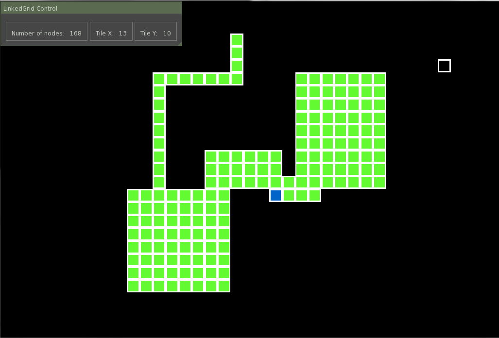

# LinkedGrid
A container class for a linked grid data structure.

It can be used like a normal 2D array with negative indices. Nodes/elements can be added everywhere.

Example from GUI test:

(The blue node is the root node)
